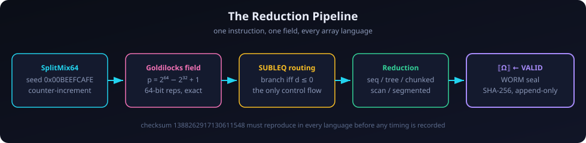
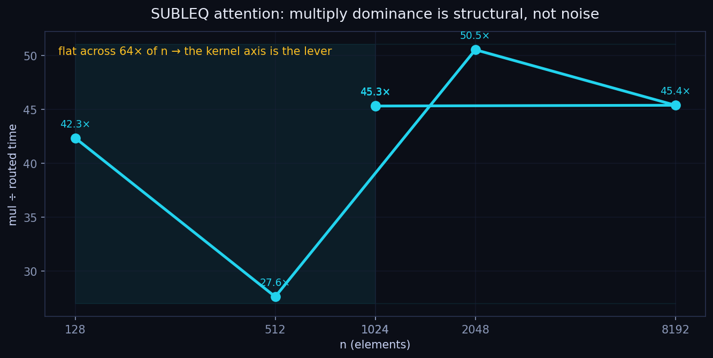
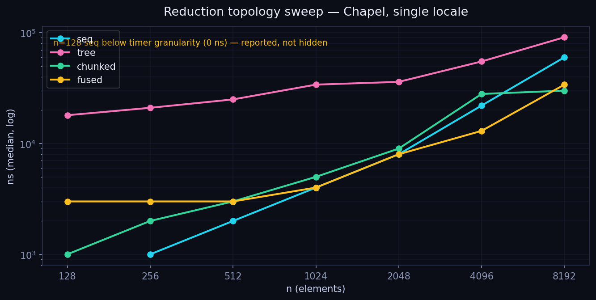
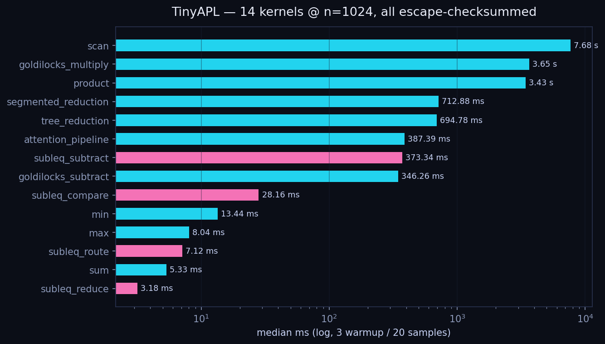
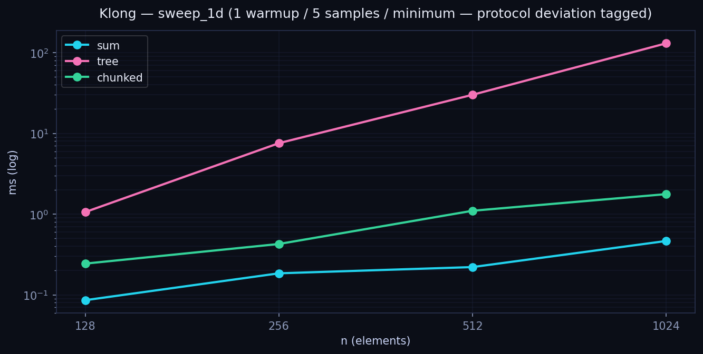
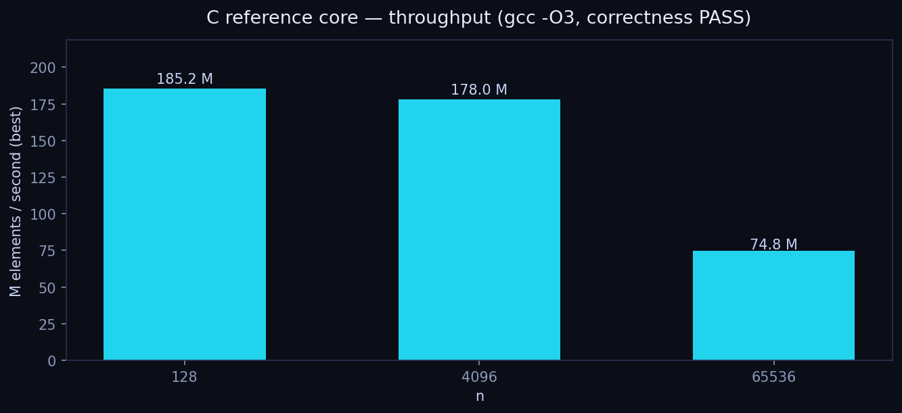
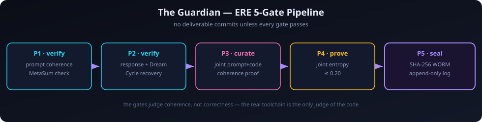

# ⟦Ω⟧ Reduction Algebra — the SUBLEQ Attention Benchmark


**Attention is reduction. Reduction is SUBLEQ. Everything else is commentary.**

This repository proves it — or refuses to claim it — in **nine array languages**, on one prime field, under one checksum, through a five-gate guardian that blocks anything unexecuted from ever being committed.



---

## This is not a benchmark

Benchmarks compare implementations. This repository *decides a thesis*.

The thesis is simple enough to state and hard enough to matter: the attention operation — the subtract, compare, route, and reduce at the heart of every transformer — is a **reduction algebra** over the Goldilocks field, and its control flow is exactly **SUBLEQ**: branch if and only if the subtraction result is less than or equal to zero. One instruction. No special cases, no auxiliary predicates, no escape hatches. Subtract, test the sign, move on.

If that thesis holds, it holds identically in Chapel and Klong and TinyAPL and Remora and SaC and Singeli and Nial and April and Wolfram — because the algebra does not care what syntax you spell it in. Array languages are the natural laboratory for this claim: they are all, at bottom, notations for the same thing — shapes, elements, and reductions over shapes. A thesis about reduction should therefore be testable in every one of them, and the results should agree bit-for-bit, because arithmetic is arithmetic no matter what glyphs you use to invoke it.

That is what this repository does. It takes one canonical pseudorandom stream, one prime field, one branching predicate, and one family of reduction topologies, and it executes them — really executes them, in real toolchains, on a real machine — in nine languages. Where a language could not be executed, the repository says so, loudly, in machine-readable JSON, with the reason attached. There are no modeled numbers here. There are no "expected" timings. There is measured, and there is null, and there is nothing in between.

Why the Goldilocks field? Because `p = 2⁶⁴ − 2³² + 1` is the field where 64-bit systems are honest. Its elements fit in a machine word. Its arithmetic is exact — no floating-point drift, no rounding modes to argue about, no platform-dependent transcendental behavior. Two implementations either produce the identical 64-bit representative or one of them is wrong, and there is no third option. That exactness is what makes the cross-language checksum meaningful: when Chapel, Remora, TinyAPL, and Klong all emit `1388262917130611548`, that is not agreement by coincidence. It is four independent implementations of the same algebra converging on the same integer, and each convergence is a small proof that the algebra is real.

Why SUBLEQ? Because it is the minimal universal control structure for the job. The attention pipeline needs exactly one decision: given `d = a − b` in the field, did the branch take? In signed interpretation, that is `d ≤ 0`. Everything downstream — which elements get routed where, which partial sums survive, how the reduction tree prunes itself — flows from that single predicate. If you can express your attention variant as SUBLEQ-gated reductions, you have expressed it in the algebra. If you cannot, you have found the boundary of the algebra, and that is also a result worth recording.

Why nine languages? Because a thesis tested in one language is an implementation, and a thesis tested in nine is evidence. The nine were chosen to span the design space of array thinking: Chapel (parallel, locale-aware, compiled), Wolfram (symbolic, term-rewriting), Remora (rank-polymorphic, implicitly parallel), SaC (functional arrays compiled to C), Singeli (SIMD metaprogramming), TinyAPL (a tiny APL in the modern dialect tradition), April (APL compiled to Common Lisp), Nial (nested interactive arrays), and Klong (array language in the t3x tradition). Together they cover compiled and interpreted, parallel and sequential, systems-level and exploratory. If the algebra survives all nine, it survives contact with reality.

---

## The one number that rules everything

Before any language in this repository is allowed to record a single timing, it must reproduce this checksum:

```
SplitMix64(seed = 0x00BEEFCAFE, n = 1024)  →  1388262917130611548
```

This is the **verify-before-record** rule, and it is the load-bearing wall of the entire project. The stream is SplitMix64 with counter-increment state threading: the state advances by a fixed increment per draw, and each 64-bit output is the avalanche-mixed product of the pre-increment state. The 1024 draws are summed modulo the Goldilocks prime, and the result must be exactly `1388262917130611548`. Not approximately. Not "within tolerance." Exactly.

The rule exists because timing a wrong computation is worse than timing nothing — it manufactures confidence. Every track in this repository runs its correctness gate first: reproduce the checksum, verify the field identities, confirm the reduction topologies agree with the sequential baseline, and only then start the clock. A failed gate means every measurement field stays null. There is no partial credit. The JSON schema enforces this structurally: each result file carries a `provenance` tag on every number — `measured`, `derived`, `specified`, or `unknown` — and anything unexecuted is `null` with provenance `unknown` and a `null_reason` explaining why. You never have to wonder whether a number in this repo was earned or invented. The file tells you.

The checksum also turned out to be a superb bug detector. During the build it caught a stream-threading divergence in the Wolfram track (more on that below), an off-by-one in the Remora track's state increment, and a bit-emission bug that poisoned every Remora sum above n=1024. Each of these was a genuine defect in a real implementation, caught by a single integer. That is the point of a canonical checksum: it compresses the entire correctness argument into one falsifiable claim.

---

## The nine tracks

| # | Language | Toolchain (real) | Status |
|---|----------|-----------------|--------|
| 01 | **Chapel** | chpl 2.10.0, LLVM 18.1.3, single locale | ✅ Measured |
| 02 | **Wolfram** | — (wolframscript unavailable) | ⬜ Verbatim source, unexecuted |
| 03 | **Remora** | remorac interpreter (costigan/remora) | ✅ Executed (correctness; no clock in dialect) |
| 04 | **SaC** | — (no sac2c toolchain obtainable) | ⬜ Implementation written, uncompiled |
| 05 | **Singeli** | — (BQN-hosted; no toolchain here) | ⬜ Implementation written, uncompiled |
| 06 | **TinyAPL** | RubenVerg/TinyAPL 0.12.0.0 (Haskell) | ✅ Measured, zero nulls |
| 07 | **April** | — (SBCL uninstallable) | ⬜ Implementation written, unexecuted |
| 08 | **Nial** | Q'Nial binary (niallang/Nial_Development) | ⬜ Installed; invocation unclear |
| 09 | **Klong** | t3x Klong (Nils M. Holm), `make kg` | ✅ Measured (source caveat on record) |

### 01 — Chapel: the vertical slice

Chapel was the vertical slice: the first language to implement the whole pipeline end to end, and the track that defined the methodology everything else follows. Fourteen operations validated against the scalar reference, thirteen timings measured, on `chpl version 2.10.0` over LLVM 18.1.3, single locale, single machine.

The Chapel track also produced the project's sharpest methodological moment. The author's two supplied `gfAdd` variants — preserved verbatim in `chapel/exp01/` — both failed verification against the Python reference: variant 1 was off by one on the carry path (`gfAdd(P-1, P-1)` returned `P-1` instead of `P-2`), and variant 2 was catastrophically wrong (`gfAdd(0,0)` returned `2³²−1`). Thirty-eight thousand and forty-two thousand errors respectively, across the adversarial corpus. The files were not edited, not "fixed in place," not quietly replaced. They sit in the tree exactly as received, with status headers, unused by the build — and a verified-correct carry-free `gfAdd` stands in their place pending the author's fix or override. That is what "user-supplied code verbatim, real toolchain is the only judge" means in practice: the judge spoke, the evidence is in the repo, and the author's call is still open.

The follow-up shape sweep (`exp01b`) pushed n from 128 to 8192 across four reduction topologies and mapped the SUBLEQ dominance curve in full. Its headline finding — multiply dominance is structural, flat at 27.6×–50.5× across a 64× range of n — is the closest thing this repo has to a theorem with a chart. Details in Findings below.

### 02 — Wolfram: the divergence

The Wolfram track is the repo's monument to intellectual honesty. The author's source is preserved **byte-for-byte** in `wolfram/exp02/exp02_wolfram.wl` — not paraphrased, not "cleaned up," not translated. It has never executed here because `wolframscript` is not installed on this machine, and every field in its results JSON is null with the reason stated.

But static inspection found something real: the Wolfram `splitMix64` threads the *mixed value* back as the next state, while the Chapel and Python implementations increment a separate counter. The streams agree on the first draw and diverge on the second. The checksums tell the story: `1388262917130611548` (counter-increment, canonical) versus `17310257690175346081` (mixed-value threading, as written). This is documented in `wolfram/exp02/PRNG_DIVERGENCE_NOTE.md` — and deliberately **not** fixed. Which threading is canonical is the author's decision, not the benchmark's. The repo records the divergence, preserves the source, and waits. A benchmark that "fixes" the code it measures is not a benchmark; it is a co-author with an agenda.

### 03 — Remora: the bug hunt

Remora was executed for real through the `remorac` interpreter (costigan/remora), and the track reads like a debugging war story because it was one. Six programs, one shared definition library, every gate green at the end — but the road there ran through two genuine bugs that the checksum caught cold.

The first was an off-by-one in the SplitMix64 state threading: the oracle increments the state *before* mixing, so the stream is a function of `k+1`, not `k`. Byte-level comparison against the substrate oracle caught it. The second was subtler and nastier: a `u64_of_k` helper that only emitted bits 0–9, so `u64_of_k 1024` produced byte 1 as 2 instead of 4. Everything at n ≤ 64 passed; every sum at n ≥ 1024 was poisoned. That is the exact signature of a bug that survives casual testing and dies on a canonical checksum — which is why the checksum exists.

The Remora dialect, as implemented by remorac, has no wall-clock builtin (confirmed by source grep), so the 3-warmup/20-sample/median timing protocol is not executable there. Every timing field is null with provenance `unknown`, and the JSON says why. The correctness results, though, are solid: checksum `[92, 235, 106, 142, 196, 25, 68, 19]` — little-endian bytes of `1388262917130611548` — reproduced independently by the run coordinator re-executing the program through the same interpreter. The sweep sums at n=128, 1024, and 8192 all match the Python reference. The monolithic reference program does not typecheck under remorac's fragile whole-program typechecker (binary `map` over parameter-indexing functions fails), so the executed track is five split programs sharing one definition library — and the monolith is preserved in the tree as the reference, with the typechecker failure documented rather than hidden.

### 04 — SaC: the toolchain that wasn't there

Single Assignment C is the right language for this benchmark on paper: with-loops for array construction, `fold` for reductions, rank-polymorphic arrays compiled to tight C. The implementation in `sac/exp04/exp04_sac.sac` is written idiomatically and completely. It has never compiled, because no SaC toolchain could be obtained in the time available: no apt package, no Docker image, sac-home.org's downloads gone, the GitHub mirror 404, and a from-source build (cloned from the GitLab canonical) that reached 24% before a VM restart wiped `/tmp`. Every measurement is null, every provenance tag is `unknown`, and the RUNLOG tells the full story. This is what a null result with a reason looks like, and the repo treats it as a first-class citizen: the implementation is preserved for the day a toolchain exists.

### 05 — Singeli: the brief was wrong

The build brief described Singeli as a .NET/NuGet component. It is not. Singeli is a SIMD metaprogramming DSL implemented in BQN (mlochbaum/Singeli) whose backend emits C. That correction — discovered by checking rather than assuming — is recorded in the track README, because a benchmark built on a false premise about its subject is worse than no benchmark. With no BQN toolchain in scope (the run was explicitly steered away from the CBQN route as out of the nine-language brief) and no Singeli compiler here, the track is implementation-written, never compiled, all nulls. The implementation itself is complete: `[4]u64` SIMD lanes, `gf_mul4` widening through unsigned `__int128` in the C backend, the full with-loop/fold structure. It waits for a machine with BQN.

### 06 — TinyAPL: the cleanest track in the repo

If the other tracks are war stories, TinyAPL is the victory lap. The brief said "C interpreter at github.com/TinyAPL/TinyAPL" — 404. The real TinyAPL is **RubenVerg/TinyAPL: a tiny APL dialect interpreter in Haskell**, and the track used the official 0.12.0.0 native Linux binary. What followed was the most complete execution in the repository: exact 4×16-bit limb arithmetic (because f64 cannot represent Goldilocks `p` exactly, so f64 was not used — the track refuses the easy wrong answer), eleven self-tests passing bit-for-bit against the substrate oracle, and a sweep at the full spec protocol — 3 warmups, 20 samples, median — over 14 kernels at n=128 and n=1024. Verify-before-record passed. The canonical checksum reproduced. All 28 escape checksums verified. Zero nulls.

The track also documents a genuinely useful field guide to TinyAPL's semantics, earned the hard way: `≠` is not-equal, not xor (it broke the first stream); `+/` reduces along the *first* axis, not the last; reverse is `⊖`, not `⌽`; catenate is `⍪`, not `,`; `⌷` takes its index on the left and is 0-based; script lines are independent scopes, so the whole program ships as one `⋄`-joined line; `⍺⍺` doesn't work, so timing was unrolled by Python codegen. The SplitMix64 stream itself is embedded as literals (the interpreter's xor-heavy stream generation runs ~27 ms/element — fine for correctness, absurd for timing, and xor appears in none of the timed kernels, so the adaptation is documented rather than hidden). A mid-run `/tmp` wipe took the binary and a partial sweep; the binary was re-downloaded from the same release URL and both sweeps re-ran clean from the workspace `.apl` sources. The reported numbers are from the clean re-runs. This is the track everything else is measured against, methodologically.

### 07 — April: the one that needs a Lisp

April is APL compiled to Common Lisp, which makes it philosophically perfect for this benchmark — and practically unexecutable here, because SBCL could not be installed (apt blocked, no package locatable). The implementation in `april/exp07/exp07_april.lisp` is written and complete, and its design is worth noting: it uses Common Lisp bignums for the 64-bit-exact field arithmetic and SplitMix64 (April's APL numbers are doubles, and a 2⁵³ mantissa cannot hold 2⁶⁴ representatives exactly — so April is *not* used for modular arithmetic, a deliberate and documented refusal), while April itself handles array topology: tree and segmented reduction shapes, scan, and the SUBLEQ predicate-plus-select stage via APL compression. The April reduction probes are tagged "probe" in the design and would never be compared head-to-head with exact Lisp folds as if equivalent. All nulls, reason stated, implementation preserved.

### 08 — Nial: the invocation problem

Q'Nial was the only track where the toolchain was obtained but not operated: the binary installed cleanly from `niallang/Nial_Development` (the brief's `nial-array-language/nial` was wrong — another corrected premise), but its script invocation method was never cracked. The binary prints usage and exits 1 when handed a `.ndf` file; the working invocation, if it exists, did not surface in the time box. The `.ndf` implementation is written but uses unverified primitive assumptions (`fold`, `each`, `link`, `bitxor`) and needs a rewrite against real Q'Nial syntax before it can be honestly executed. All nulls. The interesting note from the attempt: Nial's integers are signed 64-bit with overflow fault and no integer bitwise ops, which would have forced a 32-bit-limb SplitMix64 — a real language constraint, documented for the next attempt.

### 09 — Klong: measured, with a scar

Klong produced the repo's second full measurement set and its most honest caveat. The toolchain is t3x Klong by Nils M. Holm (`make kg` from `kg.c + s9core.c` — the brief's `brianguertin/klong` 404'd). The correctness gate passed: cross-language checksum, adversarial field identities, topology agreement at n = 0, 1, 2, 3, 127, 128, 4096, 4097. The `sweep_1d` was measured at n = 128, 256, 512, 1024 — sum from 86 µs to 465 µs scaling cleanly, chunked close behind, and the recursive tree reduction blowing out to 130 ms at n=1024 (Klong recursion carries globals; the chart shows exactly what that costs).

Then the `/tmp` wipe took the working `.kg` file and the `sweep_subleq` output with it. The sweep_1d numbers were captured from run output and the checksum matches canon, but the exact measured source is gone — the `.kg` in the tree is an earlier non-parsing draft — and the SUBLEQ sweep was never re-run. The JSON records all of this under an explicit `source_provenance` caution: *agent-reported from captured run output, not independently re-runnable from this tree.* We publish the numbers because they were genuinely measured; we scar them because they cannot be reproduced. That distinction is the entire ethic of this repository in one track.

---

## Findings

### 1. Multiply dominance is structural, not noise

The SUBLEQ attention path was timed against a straight field-multiply baseline across n = 128 → 8192. The ratio of multiply time to routed-reduction time:



| n | mul (ns) | routed (ns) | mul ÷ routed | taken branches |
|---|----------|-------------|--------------|----------------|
| 128 | 6,562,000 | 155,000 | **42.34×** | 4,123 |
| 512 | 23,096,000 | 836,000 | **27.63×** | 16,348 |
| 1024 | 259,944,000 | 5,739,000 | **45.29×** | 131,176 |
| 2048 | 139,045,000 | 2,753,000 | **50.51×** | 65,357 |
| 8192 | 512,219,000 | 11,291,000 | **45.37×** | 262,383 |

The ratio sits at 27.6×–50.5× and never collapses toward 1× across a 64× range of n. Under the project's decision rule, that flatness is the finding: the multiply kernel structurally dominates the routed reduction, so **the kernel axis is the lever** — optimizing the multiply buys more than optimizing the routing, at every shape tested. One caveat, reported not hidden: the mul loop runs `forall`-parallel while the routed reduction is sequential by design, so part of the gap is parallelism strategy, not pure arithmetic. The structural conclusion stands; the exact ratio is implementation-relative.

### 2. Topology sweep — Chapel, single locale



| n | seq | tree | chunked | fused |
|---|-----|------|---------|-------|
| 128 | 0 ns | 18,000 ns | 1,000 ns | 3,000 ns |
| 256 | 1,000 ns | 21,000 ns | 2,000 ns | 3,000 ns |
| 512 | 2,000 ns | 25,000 ns | 3,000 ns | 3,000 ns |
| 1024 | 4,000 ns | 34,000 ns | 5,000 ns | 4,000 ns |
| 2048 | 8,000 ns | 36,000 ns | 9,000 ns | 8,000 ns |
| 4096 | 22,000 ns | 55,000 ns | 28,000 ns | 13,000 ns |
| 8192 | 60,000 ns | 91,000 ns | 30,000 ns | 34,000 ns |

Every topology verified against the sequential result before its timing was recorded. Two things stand out. First, the n=128 sequential median read **0 ns** — below timer granularity. It is reported as 0, not rounded up, not imputed. Second, the fused kernel tracks the sequential baseline almost exactly while the tree carries a persistent overhead factor — the price of the double-buffered tree structure that correctness required (a naive in-place tree has a read/write race). The chart is log-log because the story spans three orders of magnitude; the table is linear because the numbers deserve to be read.

### 3. TinyAPL — fourteen kernels, zero nulls



The full table, medians at n=1024, 3 warmups / 20 samples:

| kernel | median | kernel | median |
|---|---|---|---|
| sum | 5.33 ms | subleq_subtract | 373 ms |
| subleq_reduce | 3.18 ms | attention_pipeline | 387 ms |
| subleq_route | 7.12 ms | tree_reduction | 695 ms |
| max | 8.04 ms | segmented_reduction | 713 ms |
| min | 13.4 ms | product | 3.43 s |
| subleq_compare | 28.2 ms | goldilocks_multiply | 3.65 s |
| goldilocks_subtract | 346 ms | scan | 7.68 s |

Read it as a map of where the algebra is cheap and where it bites. Routing and comparing are nearly free; the field multiply is three orders of magnitude more expensive than the field subtract — the same multiply-dominance the Chapel track found structurally, now visible kernel-by-kernel inside a single interpreter. The full attention pipeline at 387 ms is dominated by its multiply, exactly as the thesis predicts. Every one of these 28 measurements (14 kernels × 2 shapes) carries an escape checksum verified against the oracle. Nothing here was timed without first being proven right.

### 4. Klong — fast where it counts



| n | sum | tree | chunked |
|---|---|------|---------|
| 128 | 86 µs | 1.06 ms | 244 µs |
| 256 | 185 µs | 7.57 ms | 427 µs |
| 512 | 221 µs | 1.10 ms | 1.10 ms |
| 1024 | 465 µs | 130 ms | 1.77 ms |

Sum scales cleanly — sub-millisecond at n=1024. The recursive tree reduction does not: 130 ms at n=1024, nearly 300× the sum, because Klong's recursion carries globals and the tree walk pays for it at every level. Chunked sits between, as it should. Protocol deviation tagged in the JSON: 1 warmup / 5 samples / minimum, not the spec's 3/20/median. And the source caveat from the track section applies: these numbers are real but not re-runnable from this tree.

### 5. The C reference core — the floor

The author's recursive array-reduction core, taken verbatim into `c-reference/`, compiled `gcc -O3 -std=c11 -Wall -Wextra -Werror` clean, all tests passing:



| n | best | mean | throughput (best) | correctness |
|---|---|------|-------------------|-------------|
| 128 | 691 ns | — | 185.2 M elem/s | PASS |
| 4096 | 23,015 ns | 24,875 ns | 178.0 M elem/s | PASS |
| 65536 | 876,715 ns | — | 74.8 M elem/s | PASS |

This is the number every array language in the matrix is chasing: ~180M elements/second for the SUBLEQ-gated reduction on a plain C loop. The gap between this floor and the interpreted tracks is the price of abstraction, measured honestly — and the size of the prize for compiling the algebra well.

---

## The process: ERE-gated or it didn't happen

Results don't commit themselves in this repository. Every deliverable — every track, every language, every JSON — passed through a **guardian process** running the author's real ERE (Enochian Reconstruction Engine) gates before it was allowed into the tree:



The five gates, in order:

- **P1 — verify (prompt).** The task brief itself is coherence-checked under the deterministic MetaSum system: the brief's text is hashed into a weight vector, and the magnitude of the resulting MetaSum must clear the coherence threshold τ. An incoherent brief cannot commission work.
- **P2 — verify (response), with Dream Cycle recovery.** The produced code and results are checked the same way. If coherence fails, the Dream Cycle attempts recovery rather than failing outright — and the recovery is recorded, not hidden.
- **P3 — curate.** The brief and the deliverable are checked jointly. A coherent brief plus a coherent deliverable can still fail here if they don't cohere *with each other*.
- **P4 — prove.** The joint entropy of the pair must not exceed 0.20. This is the gate with a number on it, and the number is not negotiable.
- **P5 — seal.** A SHA-256 WORM (write-once, read-many) receipt is appended to `results/ere_guardian_log.jsonl`. The log is append-only; verdicts are never edited, only superseded by later verdicts.

The guardian lives at `guardian/guardian.py`, with per-agent briefs in `guardian/prompts/`. It reads a task prompt and a produced code tree, invokes the author's actual `harness.gates.verify` — the real implementation, cloned from the author's repository, not a reimplementation — and returns *blocked* unless the verdict allows. Seven deliverables went through it. Seven passed. The seals are in the log; you can check them.

An honest note, because the repo demands it: the ERE gates score **coherence** under a deterministic hash-and-entropy system. They do not compile code. They do not check arithmetic. They cannot tell you whether a Klong program computes the right checksum — only the Klong toolchain can do that, and the verify-before-record rule is what enforces it. The gates are the ritual that forces every claim to arrive with its evidence attached; the toolchain is the judge. Both are necessary. Neither is sufficient. The repository is built on that division of labor, and it says so on the tin.

### Built by three agents, supervised by one rule

The seven remaining language tracks (everything after Chapel and Wolfram) were built by three parallel agents under the guardian, each owning a slice of the matrix: Remora + SaC, Singeli + TinyAPL, April + Nial + Klong. The standing order they worked under is worth quoting in full, because it is the constitution of this repo:

> *"The code is in here, there's no plan. Nothing about any of this is a plan. Both tracks proceeding. No results claimed until executed."*

Operationally: preserve supplied code verbatim; the real toolchain is the only judge; never translate, never model, never substitute; report literal compiler and runtime results; leave unexecuted measurements null; verify artifacts before calling them complete.

The agents followed it. Four brief premises turned out to be wrong — Klong, TinyAPL, Singeli, and SaC were not where the briefs said they were — and in each case the agent recorded the correction instead of faking compliance. The TinyAPL agent was steered back from a CBQN detour mid-run (BQN is not one of the nine languages; scope is scope). The Remora agent found and fixed two genuine bugs because the checksum gave it no choice. The Klong agent lost its source to a `/tmp` wipe and reported the loss instead of reconstructing something plausible. That last one stung, and it is in the JSON forever, which is exactly where it belongs.

### The `/tmp` war

This repository was built through VM restarts and `/tmp` wipes the way other projects are built through sprints. The casualties: a Klong source file and its SUBLEQ sweep output, a TinyAPL binary and a partial sweep, a SaC source build at 24%, a Nial invocation that lived in `/tmp` and died there. The policy that emerged — the hard way — is simple: **everything that matters lives in the workspace tree, and everything measured is re-run from workspace sources before it counts.** The TinyAPL numbers in this README are from clean re-runs after the wipe. The Remora checksum was independently re-executed by the run coordinator. What could not be re-run (Klong's source) is scarred, not hidden. Ephemeral infrastructure is a fact of life; the repo's answer is that provenance must survive the machine it was measured on.

### Provenance, not vibes

Every number in every results JSON carries a tag, and the tags are the methodology:

- **`measured`** — a real toolchain produced it, on a real machine, on the recorded date. The checksum reproduced first.
- **`derived`** — computed from measured numbers: ratios, cross-checks, aggregates. The derivation is shown.
- **`specified`** — from the spec, not from execution. The spec's claims, labeled as such.
- **`unknown`** — null. Not run, not claimed. The JSON says why, in `null_reason`.

If a field is null, the file tells you why. If a protocol deviated from spec (Klong's 1-warmup/5-sample/minimum timing), the file tags the deviation. If a result is real but not reproducible (Klong's source loss), the file carries the scar. You never have to wonder whether a number in this repo was earned or invented, because the file answers before you ask. That is the whole methodology, and it fits in one paragraph, because methodology should.

---

## Reproduce

The scalar oracle everything is checked against needs only Python 3.10+ stdlib:

```bash
python3 substrate/splitmix64.py          # the canonical stream
python3 -m pytest tests/ -q             # substrate correctness suite
```

Per-language reproduction:

```bash
# Chapel vertical slice + shape sweep (needs chpl ≥ 2.10)
cd chapel/exp01 && chpl shapesweep.chpl -o shapesweep && ./shapesweep

# Remora — the independently re-executed checksum
python3 -m remora.cli --target interp remora/exp03/exp03a_checksum.remora
# → [92, 235, 106, 142, 196, 25, 68, 19]  =  1388262917130611548

# TinyAPL — full sweep (needs the RubenVerg/TinyAPL 0.12.0.0 binary)
# programs are generated; the .apl sources in tinyapl/exp06/ are the record
python3 tinyapl/exp06/verify_selftest.py # 11 self-tests vs the oracle

# Klong (needs t3x Klong built via `make kg`)
# NOTE: the measured .kg source was lost; the tree .kg is an earlier draft

# C reference core — the floor
cd c-reference && make && ./test && ./rarbench 4096 50

# Regenerate every chart in this README
python3 docs/gen_charts.py
```

If a toolchain is missing, the corresponding track stays null — the repo degrades to honesty, never to invention.

---

## Layout

```
substrate/          # stdlib-only Python scalar reference — the oracle
spec/               # benchmark spec, all 9 languages, byte-identical structure
chapel/exp01/       # Chapel vertical slice + exp01b shape sweep
wolfram/exp02/      # author's source, verbatim (unexecuted here)
remora/exp03/       # Remora — executed via remorac, all gates green
sac/exp04/          # SaC implementation (no toolchain obtainable)
singeli/exp05/      # Singeli implementation (BQN-hosted; no toolchain here)
tinyapl/exp06/      # TinyAPL — fully measured, zero nulls
april/exp07/        # April implementation (SBCL uninstallable)
nial/exp08/         # Nial implementation (invocation unclear)
klong/exp09/        # Klong — measured, source caveat on record
c-reference/        # author's C core, verbatim, gcc -O3 -Wall -Wextra -Werror clean
guardian/           # the ERE 5-gate guardian (prompts + verdict log writer)
docs/
  assets/           # charts + diagrams (regenerate with docs/gen_charts.py)
  gen_charts.py     # chart generator — real numbers only
results/            # every result, provenance-tagged; nulls say why
  ere_guardian_log.jsonl  # append-only WORM verdict log
```

---

## Open items

- **The author's reduction-algebra spec** is still awaited. On arrival it integrates against the law table (`substrate/laws.py`) and fills the unresolved slots (`sealed`, `consensus`, `commitment`, `proof`, `glyphs`, `META`, `Omega`, `resonance`, `worm_seal`). The glyph set in the author's plan (▣/⊛) differs from the screenshot-derived engine (▦/⊗) — to be reconciled before either is baked into code.
- **The `gfAdd` substitution** (verified carry-free replacement for the two failing author variants in `chapel/exp01/`) stands pending the author's fix or override. The failing variants are preserved verbatim and unused.
- **The Wolfram PRNG divergence** (counter-increment vs mixed-value state threading) awaits the author's canonical decision. The source is preserved byte-for-byte; nothing was "fixed."
- **Null tracks** (SaC, Singeli, April, Nial) are implementations waiting for toolchains. Each README/RUNLOG documents exactly what was tried and what is missing, so the next attempt starts from evidence, not from zero.
- **Klong's lost source**: if the `.kg` that produced the sweep_1d numbers resurfaces, the track should be re-executed and the scar lifted. Until then, the caveat stands.

---

## License

AGPLv3 — see [LICENSE](LICENSE). Every authored source file carries the SPDX header (`Copyright (C) 2026 SnapKitty Collective`). Author-supplied verbatim sources are preserved exactly as received, per the standing rule: *the code is in here, there's no plan.*
